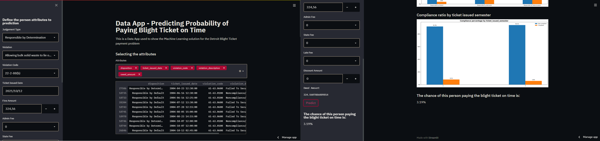

# Property-Maintenance-Blight-Ticket-Fines
 
This is the repo of the Property Maintenance Blight Ticket Fines Payment Prediction project.
 
# Project
- In this project, I built a streamlit app to predict, using a Random Forest trained machine mearning model, the chance of a resident of Detroit city to pay the blight ticket on time.
- [Webapp Link](https://share.streamlit.io/henriqueumeda/property-maintenance-blight-ticket-fines/main/app.py)

  

# Project Motivation

The base problem was from the [Detroit Blight Ticket Compliance](https://www.kaggle.com/c/detroit-blight-ticket-compliance/overview) kaggle competition organized by The Michigan Data Science Team (MDST) and the Michigan Student Symposium for Interdisciplinary Statistical Sciences (MSSISS) partnered with the City of Detroit. There were two major competitions, prediction and visualization, but I decided to create a solution using both, to simulate a real solution. As I was having fun creating my solution, I came up with the idea of building a platform to do the predictions with a trained machine learning model. 

# Repository
- csv - The folder with all csv files used
- model - The folder with all models used in the app to predict the on time payment chance
- images - The folder with all images files used in this repo

# Stack 
- Pandas
- Numpy
- Matplotlib
- Scikit-Learn
- Streamlit
